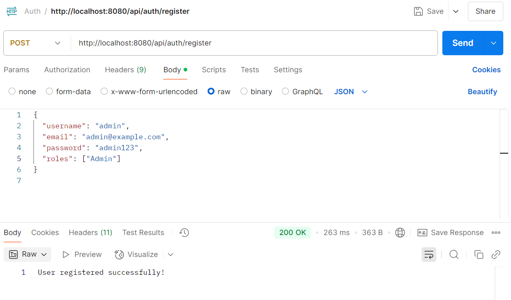
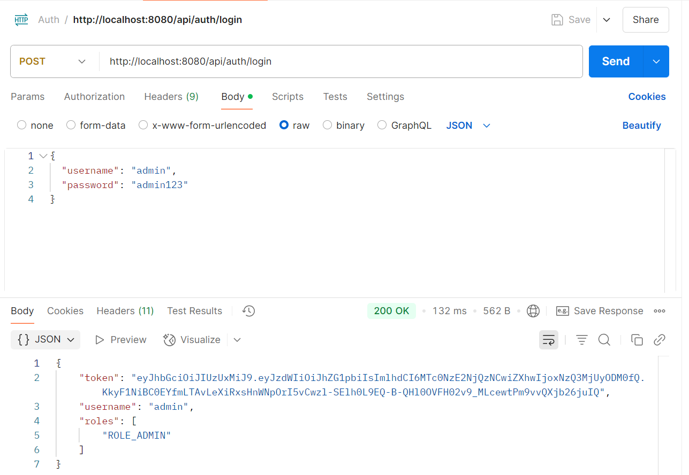
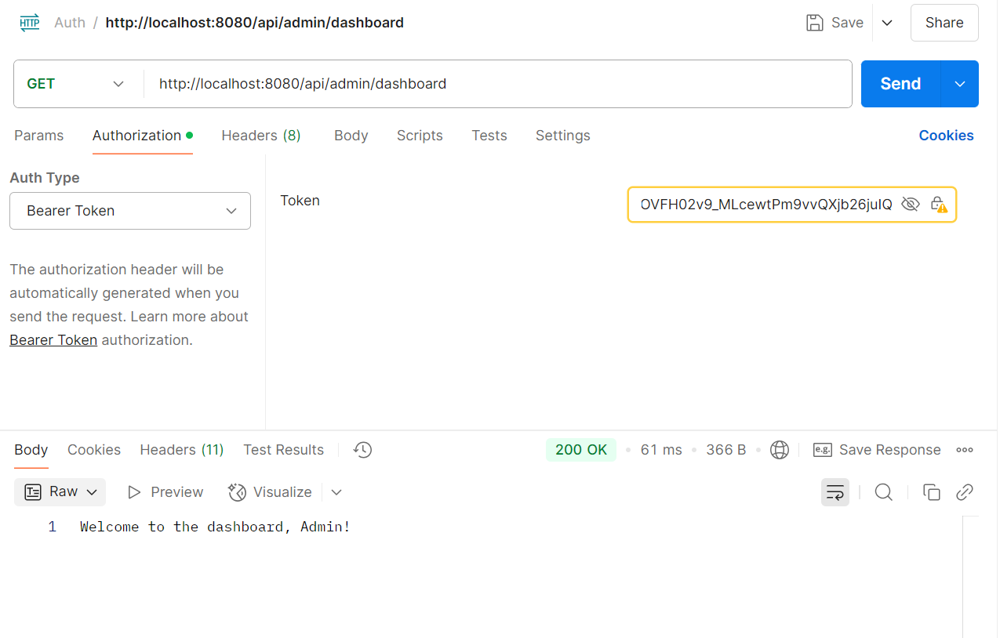
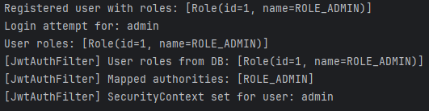

# Spring Boot JWT Auth API

This is a secure, role-based authentication API built with Spring Boot. It uses JWT tokens for stateless authentication and Spring Security for protecting routes based on user roles such as `ADMIN`, `EDITOR`, and `VIEWER`.

---

## Tech Stack

- Java 17+
- Spring Boot 3.x
- Spring Security
- Spring Data JPA
- H2 In-Memory DB
- JJWT (JWT Token Handling)
- Maven

---

## Features

- User Registration with Role Assignment
- Login with JWT Token Generation
- Role-Based Access with `@PreAuthorize`
- Secure Password Hashing
- Access Denied + Unauthorized Handlers

---

## Sample Payloads

- Register
{
"username": "admin",
"email": "admin@example.com",
"password": "admin123",
"roles": ["ADMIN"]
}

- Login 
{
  "username": "admin",
  "password": "admin123"
  }

---

## Screenshots

### Registration
Shows successful registration

### Login
Shows successful authentication using username and password. JWT token is returned and stored by the frontend.

---
### Admin Dashboard Access
Demonstrates token-protected access to the `/api/admin/dashboard` endpoint. Accessible only to users with the `ROLE_ADMIN`.

---

